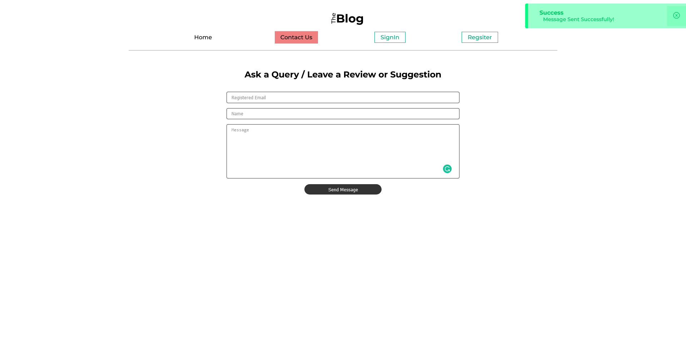

# Blog Next

This is a Blogging Website, Created Using NextJS, MongoDB, Next-Auth & Modular
CSS.

[Live Demo](https://blog-next-six-ashy.vercel.app/)

# Running Project

- Add Environment variables:

```
MONGODB_URI="<URI for MongoDB Access>"

NEXTAUTH_SECRET="<Randomly Generated SECRETE Key required by Next Auth>"
```

- Create a Build

```bash
$ npm run build
-- or --
$ yarn build
```

- Start Server

```bash
$ npm run start
-- or --
$ yarn start
```

# Project Structure

## Pages:

1. **Home**: Listing of All Blogs
2. **Contact Us**: A Contact Us Form
3. **Register**: User Registration Form
4. **Login**: User Login Form
5. **Dashboard**: User Profile
6. **Post/[slug]**: Post Details

## APIs:

1. **/api/user**: GET access to Registered Users Profile Details
2. **/api/contact**: POST Contact Form data, which is stored in MongoDB
3. **/api/auth/register**: POST Registration API, User Data is stored in
   MongoDB.
4. **/api/auth/[...nextauth]**: Dynamic API Route used by **next-auth** for
   Login, SignOut & for maintaining the USer Session

# Backend Details:

The backend is using following Technologies;

1. **Node**: For API & Accessing Blog MD
2. **Next** JS: For SSR & APIs
3. **MongoDB**: Storing User & Contact Form Data
4. **BCrypt**: For Hashing the password before storing & for securely comparing
   passwords while login
5. **Next-Auth**: For Handling User Auth. I've configured it to use JWT.

The Blog Data is stored as Markdowns & Rendered on Front-End

# Frontend Details

The Front-End is using following technologies:

1. **Next JS**: For SSR, SSG
2. **React**: Used underneath NextJS for creating UI in form of Components
3. **Axios**: For Sending Requests using API
4. **Next-Auth**: For Accessing Session, verifying Authentication Status.
5. **React-Markdown**: For Rendering the Blog Markdowns using Custom Styling
6. **React-Icons**: For SVG Icons used on the Site

# Site Screenshots

## Home


## Contact Us


## Register


## SignIn


## Dashboard


## Post Details


## Notification


